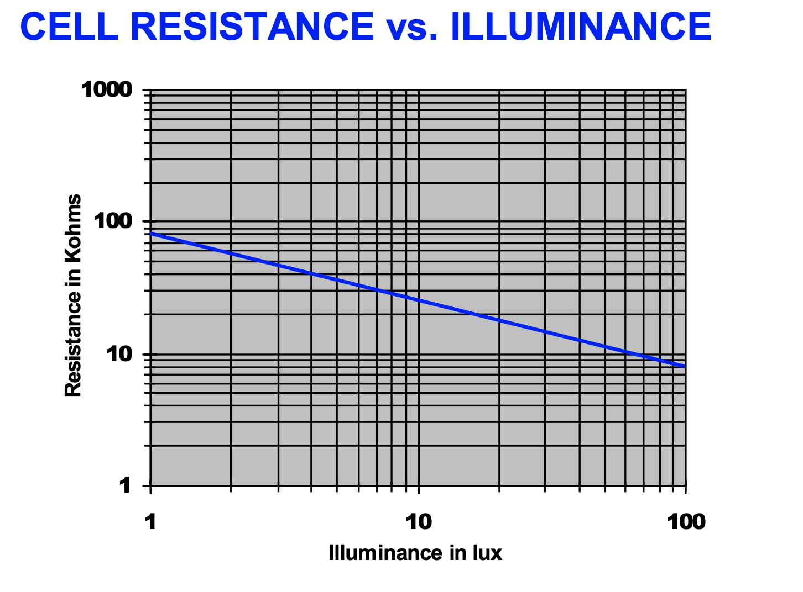
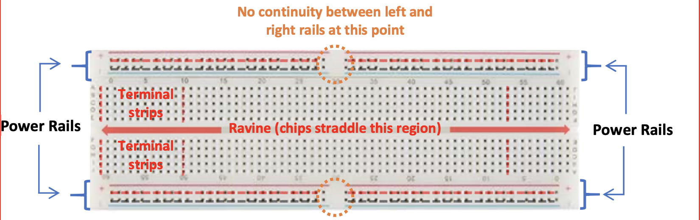
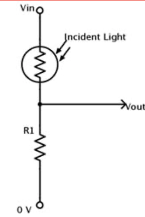

## Lab 1

### Objectives
* Learning to program the Arduino 
* Use photoresistors in conjunction with the Arduino to setup the light sensing component of a light following robot. 

### Setup (Lab 0)
In Lab 0, the working environment for future labs was set up. The various parts and components from the lab kit were organised including categorizing the resistors based on their color bands. The robot frame was built to use for future labs. The assembled robot body can be seen in the picture below. 

{:height="400px" width="500px"}

### Controlling the Arduino's Onboard LED  
After installing the Arduino IDE, I experimented with controlling the onboard LED to get familiarized with programming and using the Arduino. The onboard LED is connected to pin D13 and can be controlled by setting the pin D13 high or low. In the file blink_LED.ino, the built in pin is initialized in the setup method and made to blink in the loop method by turning the led on and off with intermittent delays. The code was uploaded to the microcontroller by first verifying and compiling it on the Arduino IDE and then uploading it to the Arduino using a USB Cable. On uploading the code, the onboard LED blinks on and off. Other examples were explored from Files>Examples>Basics. 

### CdS Photoresistors
The robot uses CdS photoresistors (cadmium sulphide). 

The resistance changes depending on the illumination i.e. the amount of light falling on them. As the light increases, the resitance decreases. From the specification sheet, we can observe the change in resistance as the illumination changes. 

{:height="400px" width="500px"}

In order to move towards the brighter light, a method to indicate which side is "brighter" must be determined. This can be done by placing two photoresistors on each side of the robot body and analysing the resistance of each photoresistor to determine the direction to move. 

In order to test a simple circuit with the photoresistor, a breadboard was used for connections. A breadboard with the connections has been shown below. 

The circuit below was wired using the breadboard.

 

A 10k ohm resistor was used as R1. Using the Arduino, Vin was connected to the +5V source on the Arduino. Vout was connected to the analog pin A0 on the Arduino to read the output voltage. The following diagram shows the wiring on the breadboard. 

{:height="600px" width="500px"}

The function analogRead was used to read the output voltage. When a flashlight was shone on the photoresistor, i.e. in bright conditions, the value read from the analog pin was around 800-900. When it was not too bright, i.e. the light was falling upon the photoresistor was blocked, the value read from the analog pin was in the range of 500 - 800. These values give a quantitative idea of how to gauge the lighting conditions by the value read from the photoresistor. 

### Sensing Light 

Next, code was implemented to interpret the values from two photoresistors mounted onto the breadboard. A similar circuit was created for the second photoresistor, giving 2 outputs connected to pins A0 and A1 of the Arduino. The wiring on the breadboard has been shown in the image below. 

{:height="600px" width="400px"}

The normalized measurement of each sensor reading was taken, i.e. normalized differnetial measurement, the value of the sensor as a fraction of the sum of values from both sensors. 
This way, if the normalized measurement for the left sensor is greater than 0.5, it is brighter on the left side, and if it is less than 0.5, it is brighter on the right side. If the normalized measurement is 0.5, the brightness is equal on both sides of the robot. 

### Authors and Contributors
Samiksha Hiranandani (snh44)

### References 
ECE 3400 Lab 1 Handout 

[back to homepage](https://pages.github.coecis.cornell.edu/snh44/ECE3400Wikipage/)

