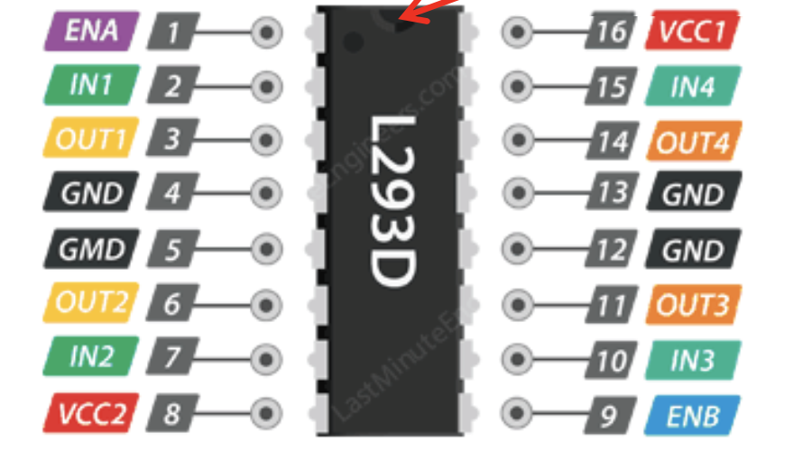

## Lab 2

### Objectives
* Using photoresistors, and motors using an h-bridge in conjuction with the Arduino to make a light-following robot. 
* The implementation should be such that the light-following robot should move towards the bright light, and move in circles (indicating confusion) when there is no bright light in either direction. 

### Furthering Understanding of the ADC (Step 0)
A sound understanding of the timing of the ADC was gained by writing short sketches in the Arduino IDE to read the individual bit values of parts of the timing registers of the ADC. The default prescaler was determined by reading the values and closely studying the datasheet. Several ADC prescaler values were tested to gain an understanding of how fast the ADC can be operated in reality. 

### Understanding and testing the H-Bridge
Using the L293D chip, the motors were connected to the H-Bridge. The following is the pinout of the H-Bridge used. 

{:height="400px" width="500px"}

The chip was mounted on the breadboard to make the connections. The connections can be seen in the following image. 

{:height="400px" width="500px"}

The H-Bridge was tested by writing values to the control pins, and the enable pin for each motor. The motors were made to move forward, and then backward by reversing the polarity of the motors. Additionally, the motors were made to turn by moving one forward and the other backward. 

Since the motors did not move at exactly the same speed, the robot did not initially move in a straight line. Through careful analysis of the robot's path of motion, appropriate values for the PWM signal were determined for the left and right motors to move in a straight line. Since the observation showed the robot turning slightly to the right, the speed of the right motor was decreased in the hope to sync its motion with that of the left motor. 

### Incorporating the Photoresistors

The Normalized Measurements and photoresistor readings from Lab 1 were used to determine the motion of the robot. 

In the loop function of the code, the sensor values were taken continuously and the normalized measurements were calculated. 

The motors of the robot were programmed to do each of the following: 
* turn around in place with the onboard LED flashing, 
* turn left to follow the bright light that is on the corresponding side of the robot with the onboard LED turned off, 
* turn right to follow the bright light that is on the corresponding side of the robot with the onboard LED turned off, or
* go smoothly straight towards the light once the robot has turned sufficiently so that it faces the light

Each of the following four states were written as 4 separate functions in the code. These functions were invoked inside of the conditional code blocks depending on which conditional statement held true. 

If the normalized measurements were close to 0.5, then the lighting conditions were analysed to determine which direction to move. If both readings were very high (indicative of a light directly in front), the robot was programmed to move straight. On the other hand, if the readings were low, the robot was programmed to move in circles (in a state of confusion as to where to go). 

If the normalized measurements for left and right sensors varied by more than 0.1, then the individual sensor values were checked. If the normalized measurement for the sensors varied by more than 0.1, then if the right sensor's normalized measurement was higher and its value was greater than a threshold, the robot was programmed to move right. If the left sensor's normalized measurement was higher and its value was greater than a threshold, the robot was programmed to move left. 

Here is a video of the robot in action!

<iframe width="640" height="480" src="https://www.youtube.com/embed/Dwt-wvjWUeE" frameborder="0" allowfullscreen></iframe>

### Authors and Contributors
Samiksha Hiranandani (snh44)

### References 
ECE 3400 Lab 2 Handout 

[back to homepage](https://pages.github.coecis.cornell.edu/snh44/ECE3400Wikipage/)

