## Lab 3

### Objectives
* Implement and test passive and active filters, and compare to theoretical frequency response
* Test a bandpass filter (to be used in Lab 4)

### Simulations (Step 0)
In order to test the accuracy of the filters, the experimental value was compared to the theoretical frequency response. The theoretical value was computed using LTSpice. The low pass and high pass filters were simulated using the Spice software, as shown in the figure below: 

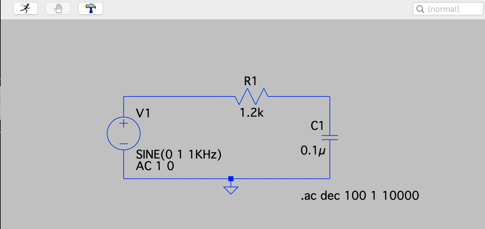{:height="400px"}

An example of the theoretical output graph (for the low pass filter in the above circuit) has been shown below: 

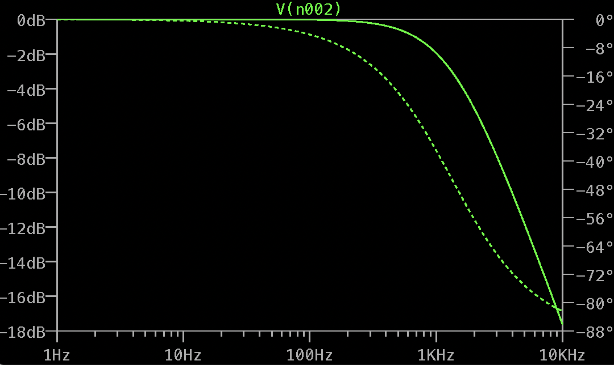{:height="400px"}

### Microphone Circuit   
The final goal is to be able to collect sound from the microphone which is processed by the Arduino. I have first implemented the microphone circuit component. This circuit will be used and additional functionality will be incorporated in lab 4. The schematic is as follows: 

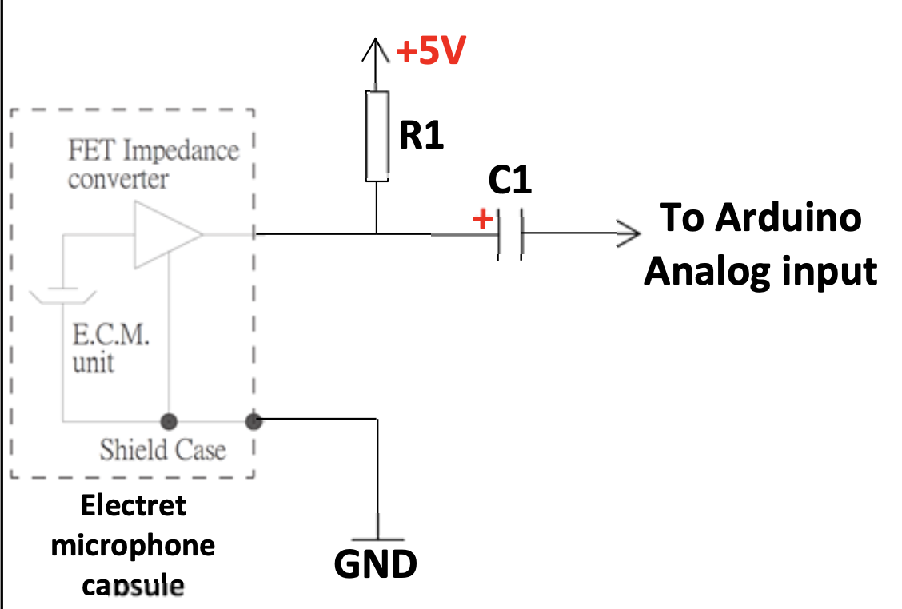{:height="400px"}

The circuit was wired on the breadboard, as shown in the picture below: 

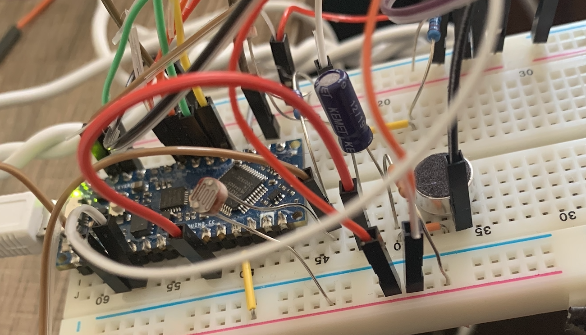{:height="400px"}

The output of the microphone was wired to the analog input pin on the Arduino. 

### Characterizing the Circuits 
While the final goal is to process the sound using the Arduino, in order to gain a more accurate analysis of the sound and understand better what happens in the frequency domain, MATLAB was used. This was facilitated by writing Arduino code to collect the sound from the microphone and print the values to the serial port, so the output could be used by MATLAB for analysis. Since the Arduino function analogRead() would be too slow for this application, the ADC was coded manually. 

Since the Arduino cannot read negative values, but the sound signals oscaillate about the x-axis, the ADC values were converted into signed 16 bit values (to have both positive and negative values). 

The data generated on the serial monitor using the Arduino was analyzed using MATLAB. Fourier analysis was performed in MATLAB using the fft function to obtain the spectrum of the signal. A sound at frequency 500 Hz was played and the following spectrum plot was obtained: 

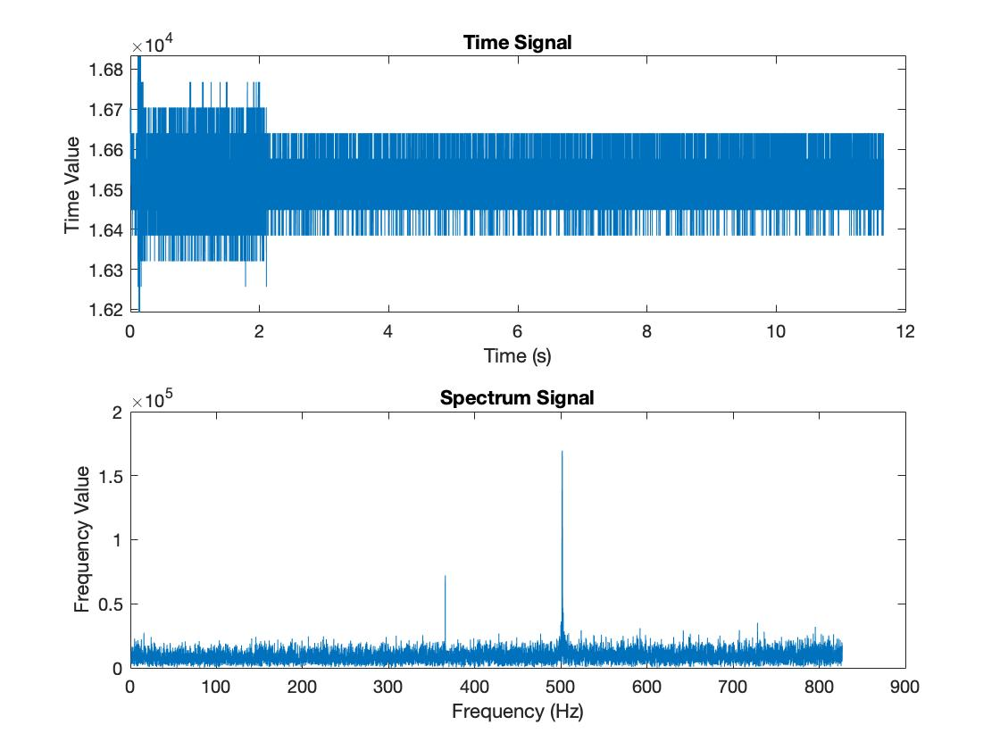{:height="400px"}

The peak at 500 Hz can be seen in the second plot. However, this is relatively weak and requires amplification. 

### Amplifier Circuit

The following schematic diagram shows the improved microphone circuit with the amplifier. An operational amplifier was used as shown below: 

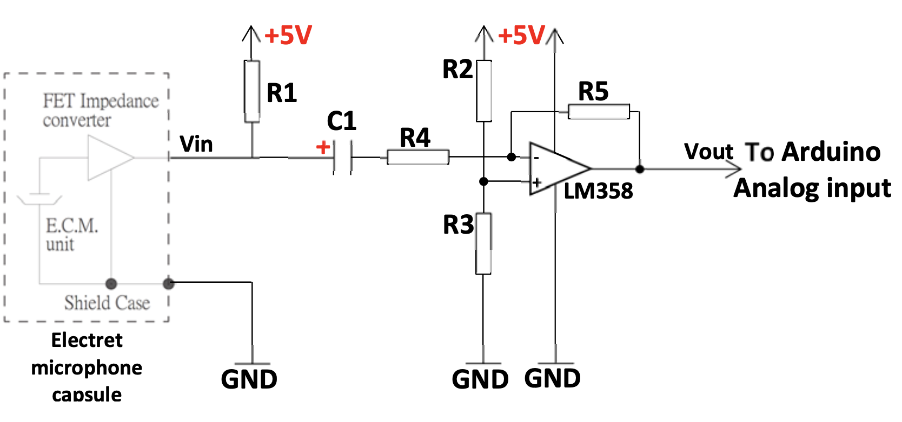{:height="400px"}

The above schematic was wired onto the breadboard as shown below: 

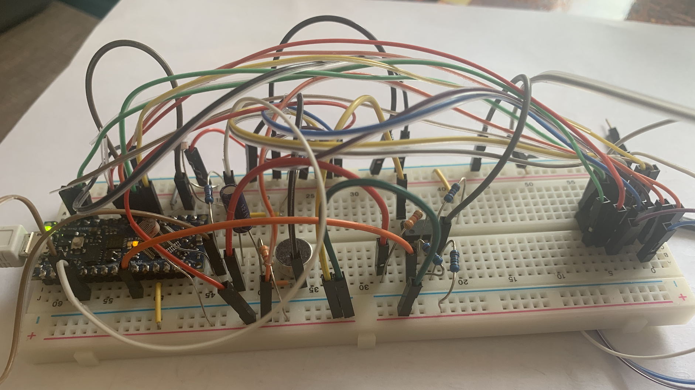{:height="400px"}

The following spectrum was obtained using matlab: 

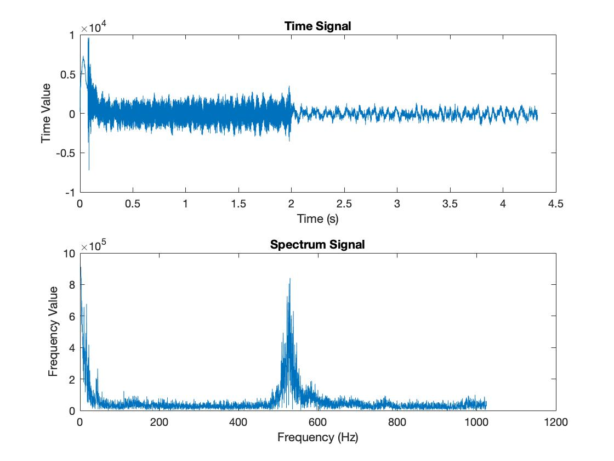{:height="400px"}

Comparing the above graph to the previous graph of the circuit without the amplifier, we can see that there is a gain of around 50. This shows that the signal has been amplified using the above circuit. 

The low pass and high pass filters were also tested using the amplified signal. 

### Bandpass filter 
A 4-pole Butterworth filter was implemented as shown in the schematic below. 

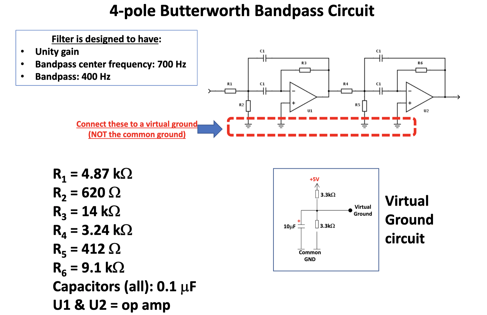{:height="400px"}

The frequency repsonse of the bandpass filter is as follows: 

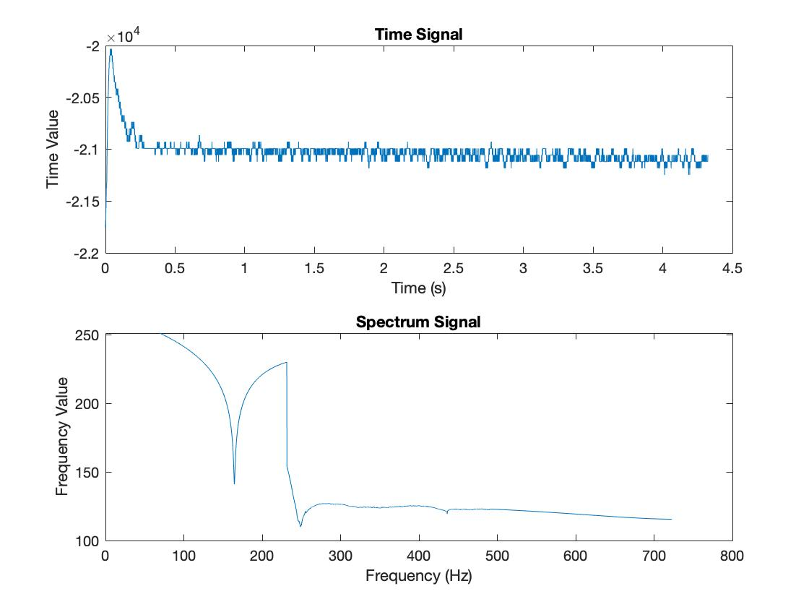{:height="400px"}

### FFT Using Arduino
The FFT function was finally implemented using the Arduino. The following are the stem plots obtained for frequencies 500 Hz, 700 Hz, 900 Hz respectively. 

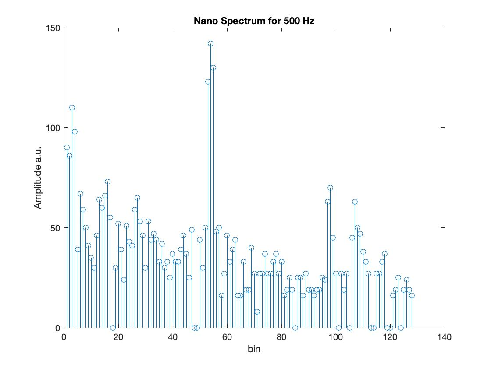{:height="200px"}
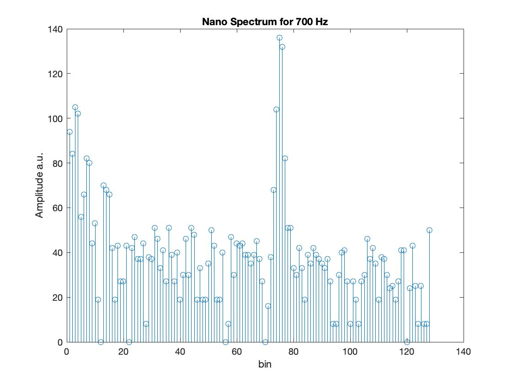{:height="200px"}
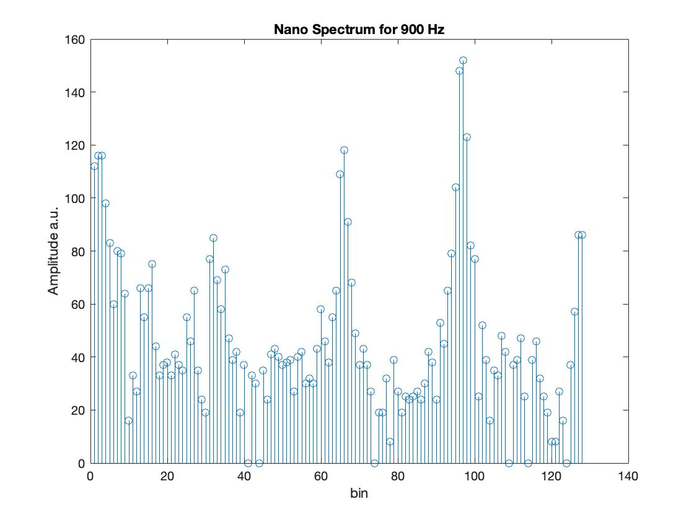{:height="200px"}

We can see that the peaks correspond to the frequency of interest. 

### Authors and Contributors
Samiksha Hiranandani (snh44)

### References 
* ECE 3400 Lab 3 Handout 
* ECE 3400 Lecture Notes 

[back to homepage](https://pages.github.coecis.cornell.edu/snh44/ECE3400Wikipage/)

