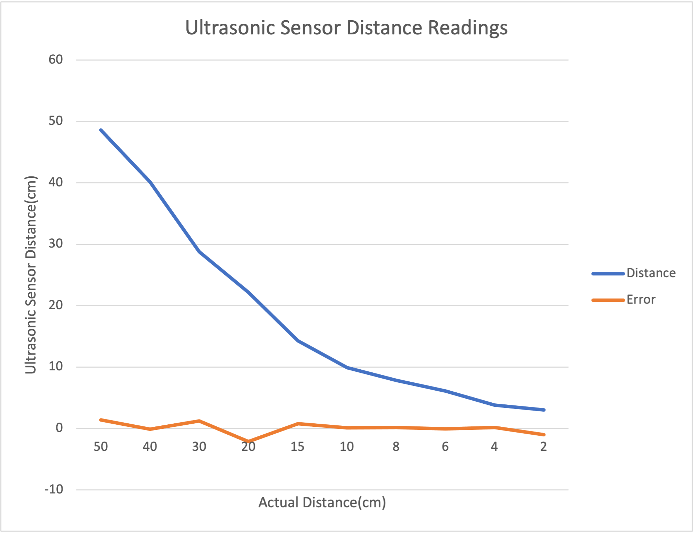
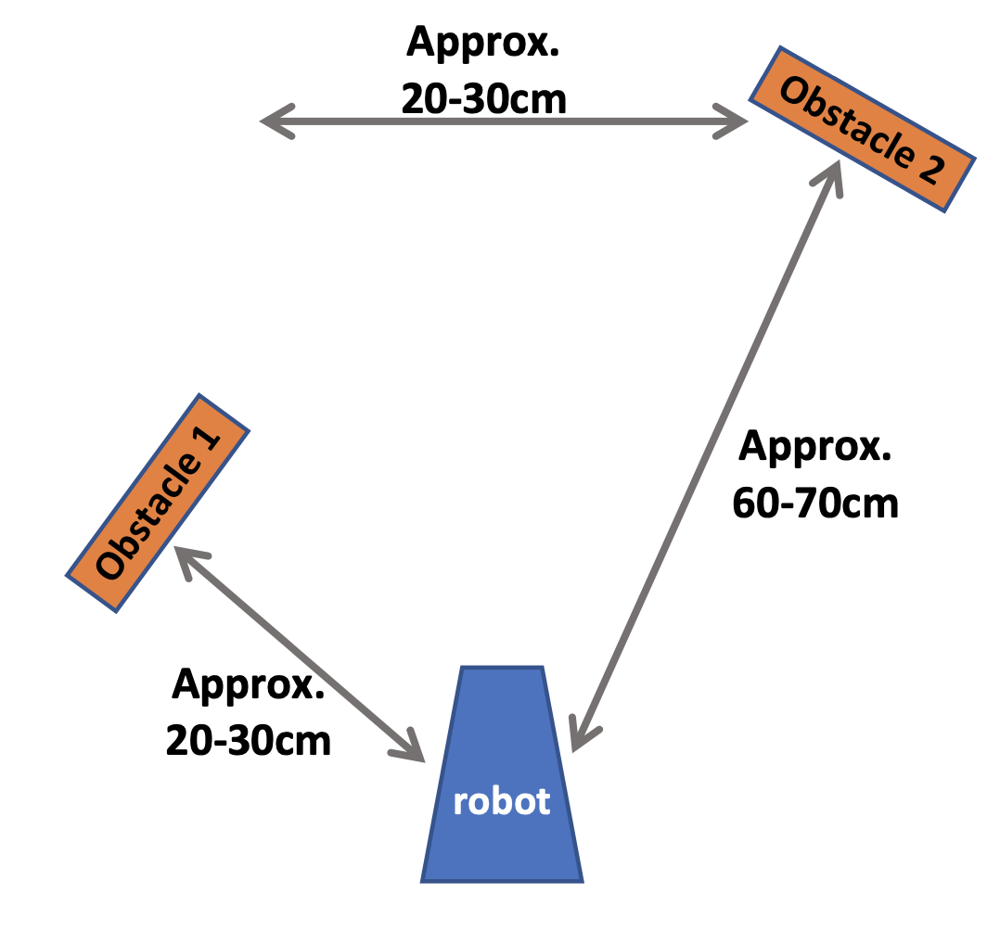
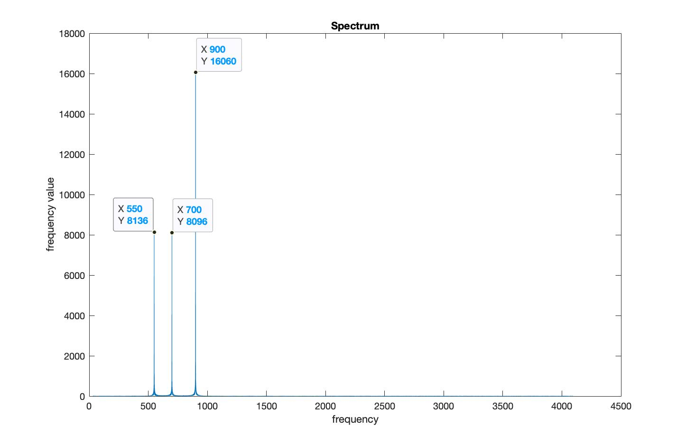
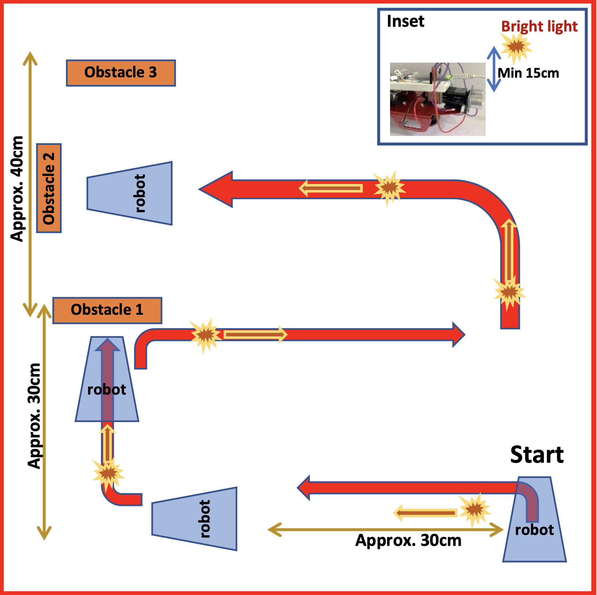

## Lab 4

### Objectives
* Code the robot to turn in place and have its onboard LED turn on or off depending if it identifies one or the other of two objects using the ultrasonic sensor
* Navigate an area in which the robot is lured with light, also reacting to the ultrasonic sensor readings. 

### Ultrasonic Sensor 
In order to sense the distance from an obstacle, an ultrasonic sensor was used. The following picture shows the ultrasonic sensor used for detection. 

{:height="400px"}

The following shows the graph of the actual vs. measured distance as per calculations done on the readings obtained from the ultrasonic sensor. 

{:height="400px"}

### Demo 1 
As an initial demo, the robot was coded to navigate the following: 

{:height="400px"}

Using the FFT Analysis done in previous labs, the robot was made to move when the trigger frequency of 550 Hz was heard. The following shows a spectrum of the demo sound played. 

{:height="400px"}

The peaks have been labelled as shown above. 

### Final Demo 
The following maze was navigated in the final demo. 

{:height="400px"}

### Authors and Contributors
Samiksha Hiranandani (snh44)

### References 
* ECE 3400 Lab 3 Handout 
* ECE 3400 Lecture Notes 

[back to homepage](https://pages.github.coecis.cornell.edu/snh44/ECE3400Wikipage/)

